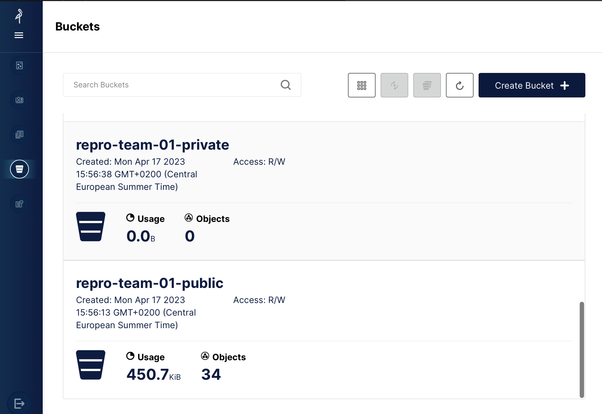

# Registration to Pangeo@EOSC

As explained in the previous section, Pangeo@EOSC is the main public deployment of the Pangeo ecosystem open to European researchers and their collaborators.
The deployment is hosted on European infrastructure and is meant to remain public and freely accessible to all European researchers. Pangeo@Europe mostly uses Pangeo@EOSC for training researchers.

In this section you will learn how to register and access pangeo@eosc services.

You need to create an [EGI Check-in account](https://www.egi.eu/service/check-in/) and enroll to the `vo.pangeo.eu` Virtual Organisation. There are several steps to follow:

1. **Sign up** for an EGI Check-in account following [these steps](https://docs.egi.eu/users/aai/check-in/signup/). **Using [ORCID iD](https://orcid.org/) to authenticate is recommended.**
2. **Enroll** in the `vo.pangeo.eu` Virtual Organisation (VO) by clicking on [the enrollment URL](https://aai.egi.eu/registry/co_petitions/start/coef:386) using the EGI Check-in account created in the previous step. Review and click on `Submit`. Please add a note in the statement of purpose (make sure you use the text given by your instructors) when requesting to join the VO explaining why you want to access `pangeo-eosc`.

:::{note}
After the Geo-Open-Hack Course, you can continue to use the resources.
We would appreciate you get in touch with us to give us some feedback and be informed of the platform evolution. You can do this through [Github Discussions](https://github.com/pangeo-data/pangeo-eosc/discussions).

You can also contribute to "the Pangeo show and tell" online meetups.
:::

## Access to Pangeo@EOSC

Access Pangeo@EOSC via [https://pangeo-eosc.vm.fedcloud.eu/](https://pangeo-eosc.vm.fedcloud.eu/) and choose among the 4 available flavors (as shown on the figure below):

- Pangeo Notebook uses a docker image maintained by the Pangeo community. It contains all the Python packages you need to data analysis and visualization. The list of packages and all the Pangeo Notebook environment is made available [here](https://github.com/pangeo-data/pangeo-docker-images); look up the `pangeo-notebook` folder. 
- Machine Learning Pangeo notebook with GPU enable tensorflow2: similarly, it is maintained by the Pangeo community and the complete computational environment with the list of Python packages is also available at [https://github.com/pangeo-data/pangeo-docker-images](https://github.com/pangeo-data/pangeo-docker-images) in the `ml-notebook` folder. This flavor contains all the packages from the Pangeo Notebook flavor and is GPU-enabled tensorflow2. Choose this flavor if you need GPUs; for instance for training neural networks;
- Machine Learning Pangeo notebook with GPU enable pytorch: it is the same as `ml-notebook` but with GPU-enabled pytorch.
- Datascience Notebook with Python, R and Julia is maintained by the Jupyter community at [https://github.com/jupyter/docker-stacks](https://github.com/jupyter/docker-stacks). Look up the `datascience-notebook` folder. It contains 3 different kernels, namely Python, R and Julia notebooks. Please note that you would probably need to add additional packages as the list of available packages is not exhaustive.

Currently (September 2023) we have configured quotas to host 20 simultaneous users with Jupyter (8 CPUs, 32GB RAM) and a Dask cluster (max: 4 workers, each worker with 8 CPUs and 32 GB RAM). This is subject to change depending on usage and resource availability at CESNET.
You need to click on `Sign in with EGI Check-in` and then use your ORCID iD credentials.

A [Dask Gateway](https://gateway.dask.org/) is available for scaling your computation. For more details on this deployment, you may want to take a look at [Daskhub helm chart](https://github.com/dask/helm-chart/tree/main/daskhub).

## Access MinIO

Each user has a very small amount of local storage when using the DaskHub as it is not meant to be used for storing large data.  Instead a dedicated [MinIO Object storage](https://min.io) has been setup.

The MinIO console endpoint is: [https://pangeo-eosc-minio.vm.fedcloud.eu/](https://pangeo-eosc-minio.vm.fedcloud.eu/). You can authenticate to the MinIO Object Storage in the same way you login to DaskHub. As shown on the Figure below, make sure you "Select Other Authentication Method" and "Login with SSO (checkin)" to access the MinIO console. Then use your ORCID iD to login.

You can create, access and manage your buckets from the minIO console (or use [minIO Python package](https://min.io/docs/minio/linux/developers/python/minio-py.html)). The figure below shows the GUI (with several tabs on the left; the bucket tab is selected on the figure): initially, you won't have any buckets so please feel free to create public/privates buckets.

In addition to the MinIO console, the API end point is `https://pangeo-eosc-minioapi.vm.fedcloud.eu/` for those who prefer to interact with MinIO via the API.

## Support

If you need support, please open an [issue](https://github.com/pangeo-data/geo-open-hack-2024/issues).

## How to acknowledge Pangeo-EOSC

[Pangeo-EOSC](https://github.com/pangeo-data/pangeo-eosc/) has benefited from services and resources provided by the [EGI-ACE project](https://www.egi.eu/project/egi-ace/) (funded by the European Union’s Horizon 2020 research and innovation programme under Grant Agreement no. 101017567), and the [C-SCALE project](https://c-scale.eu/) (funded by the European Union's Horizon 2020 research and innovation programme under grant agreement no. 101017529), with the dedicated support of [CESNET](https://www.cesnet.cz/en/).

