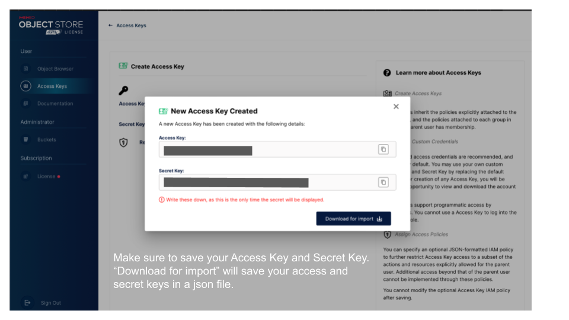

# Pangeo@EOSC s3 object storage

If you followed the setup instructions, your MinIO Pangeo@EOSC personal s3 object storage is ready to be used. However, to be able to access it via s3fs Python API, you need to set up **new Access keys**.

## Create new access key

In your web browser, go to [https://pangeo-eosc-minio.vm.fedcloud.eu](https://pangeo-eosc-minio.vm.fedcloud.eu) and login with your credentials:

- In the left menu bar, click on **Access Keys** and **Create access key**. By default, new access and secret keys are created. Copy them so you can reuse them later.

